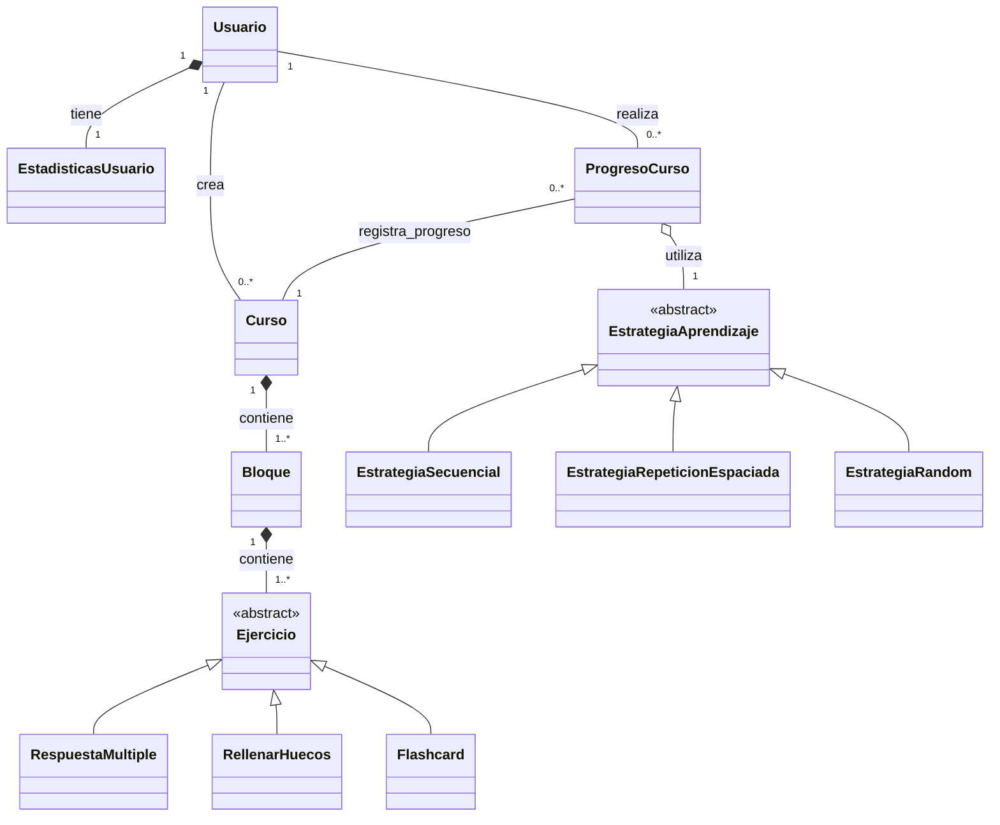

# Diagrama de modelado del dominio

```mermaid
classDiagram
    class Usuario {
    }
    class EstadisticasUsuario{
    }
    class Curso {
    }
    class Bloque {
    }
    class ProgresoCurso {
    }

    class Ejercicio {
        <<abstract>>
    }
    class EstrategiaAprendizaje {
        <<abstract>>
    }

    Ejercicio <|-- RespuestaMultiple 
    Ejercicio <|-- RellenarHuecos 
    Ejercicio <|-- Flashcard 

    EstrategiaAprendizaje <|-- EstrategiaSecuencial 
    EstrategiaAprendizaje <|-- EstrategiaRepeticionEspaciada 
    EstrategiaAprendizaje <|-- EstrategiaRandom 

    Usuario "1" *-- "1" EstadisticasUsuario : tiene
    Usuario "1" -- "0..*" Curso : crea
    Usuario "1" -- "0..*" ProgresoCurso : realiza
    ProgresoCurso "0..*" -- "1" Curso : registra_progreso
    Curso "1" *-- "1..*" Bloque : contiene
    Bloque "1" *-- "1..*" Ejercicio : contiene

    ProgresoCurso o-- "1" EstrategiaAprendizaje : utiliza
```
