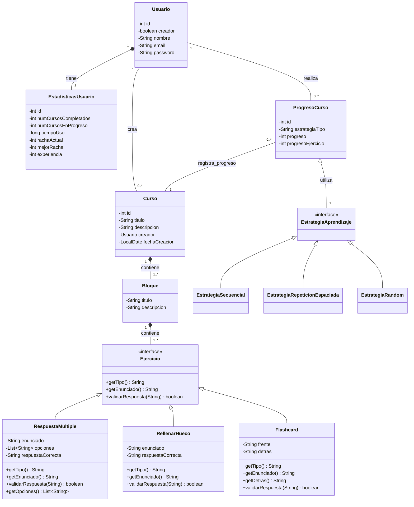

# Diagrama de modelado del dominio

```mermaid
classDiagram
    class Usuario {
        -int id
        -boolean creador
        -String nombre
        -String email
        -String password
    }
    class EstadisticasUsuario{
        -int id
        -int numCursosCompletados
        -int numCursosEnProgreso
        -long tiempoUso
        -int rachaActual
        -int mejorRacha
        -int experiencia
    }
    class Curso {
        -int id
        -String titulo
        -String descripcion
        -Usuario creador
        -LocalDate fechaCreacion
    }
    class Bloque {
        -String titulo
        -String descripcion
    
    }
    class ProgresoCurso {
        -int id
        -String estrategiaTipo
        -int progreso
        -int progresoEjercicio
    }

    class Ejercicio {
        <<interface>>
        +getTipo() String
        +getEnunciado() String
        +validarRespuesta(String) boolean
    }
    class EstrategiaAprendizaje {
        <<interface>>
    }

    class EstrategiaSecuencial {
    }

    class EstrategiaRepeticionEspaciada {
    }

    class EstrategiaRandom {
    }

    class RespuestaMultiple {
        -String enunciado
        -List~String~ opciones
        -String respuestaCorrecta
        +getTipo() String
        +getEnunciado() String
        +validarRespuesta(String) boolean
        +getOpciones() List~String~
    }

    class RellenarHueco {
        -String enunciado
        -String respuestaCorrecta
        +getTipo() String
        +getEnunciado() String
        +validarRespuesta(String) boolean
    }

    class Flashcard {
        -String frente
        -String detras
        +getTipo() String
        +getEnunciado() String
        +getDetras() String
        +validarRespuesta(String) boolean
    }

    Ejercicio <|-- RespuestaMultiple 
    Ejercicio <|-- RellenarHueco 
    Ejercicio <|-- Flashcard 

    EstrategiaAprendizaje <|-- EstrategiaSecuencial 
    EstrategiaAprendizaje <|-- EstrategiaRepeticionEspaciada 
    EstrategiaAprendizaje <|-- EstrategiaRandom 

    Usuario "1" *-- "1" EstadisticasUsuario : tiene
    Usuario "1" -- "0..*" Curso : crea
    Usuario "1" -- "0..*" ProgresoCurso : realiza
    ProgresoCurso "0..*" -- "1" Curso : registra_progreso
    Curso "1" *-- "1..*" Bloque : contiene
    Bloque "1" *-- "1..*" Ejercicio : contiene

    ProgresoCurso o-- "1" EstrategiaAprendizaje : utiliza
```
---

