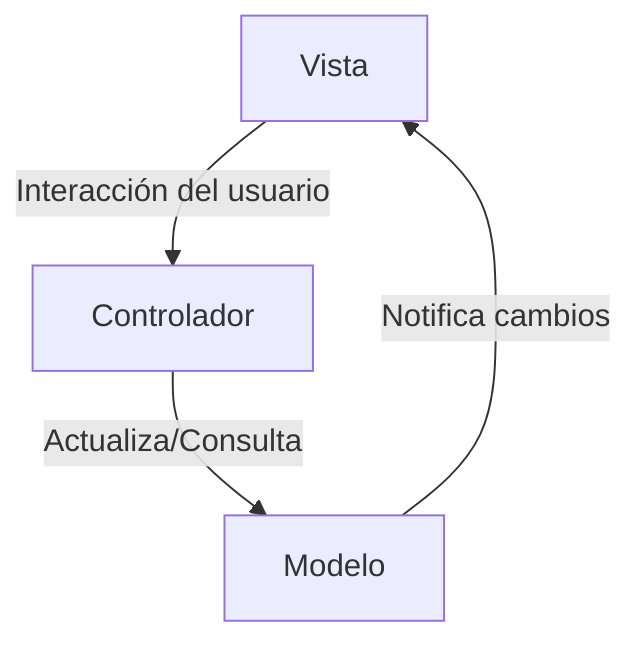
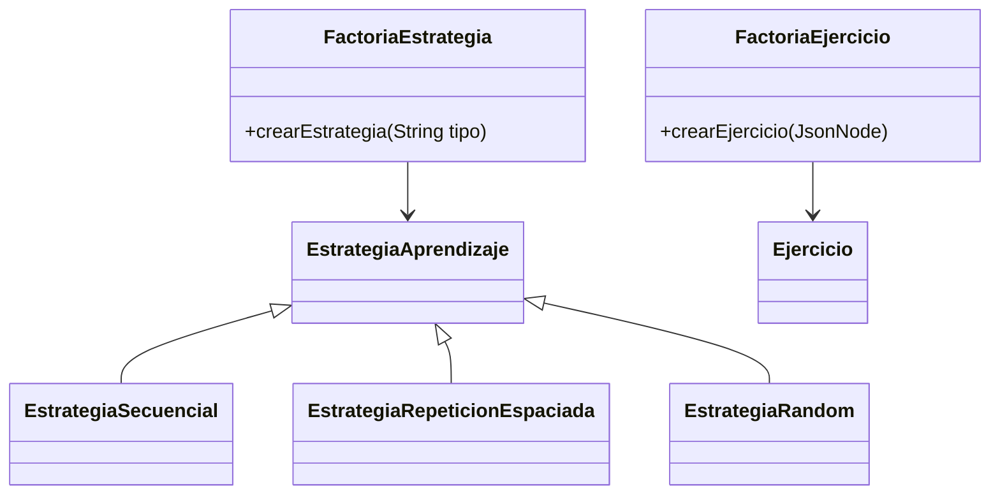
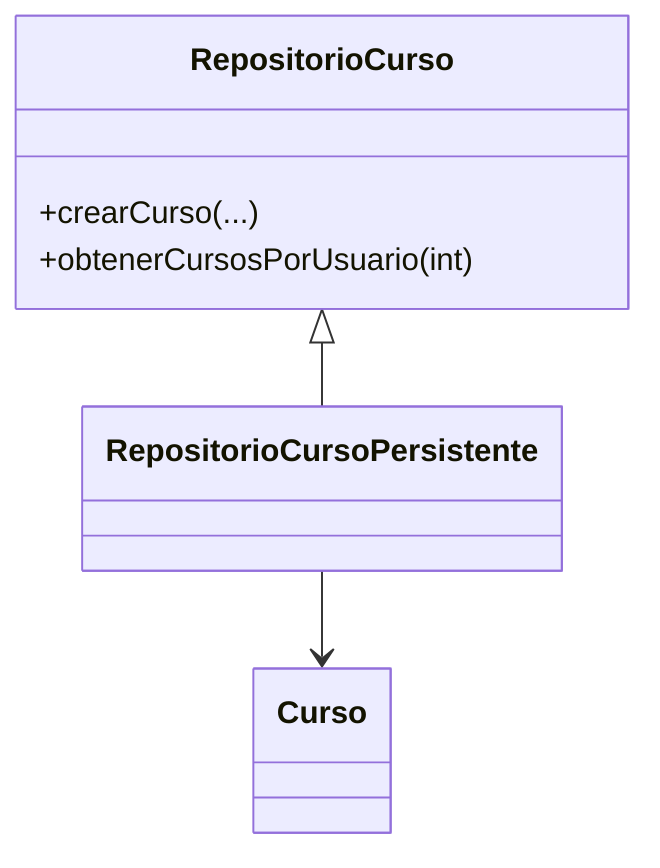
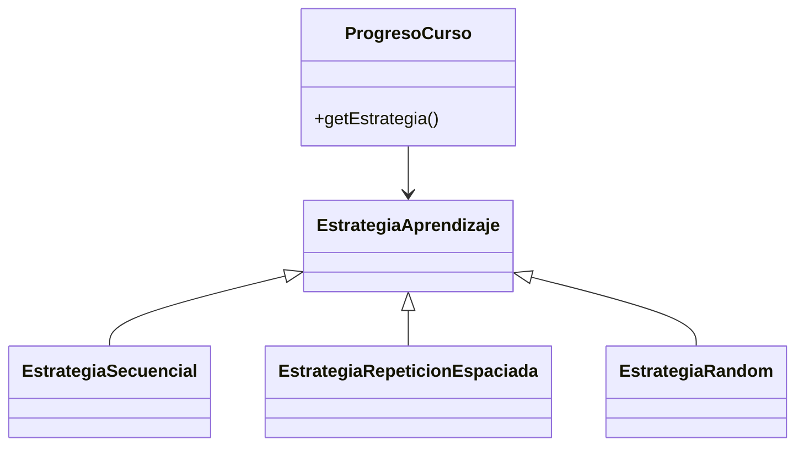
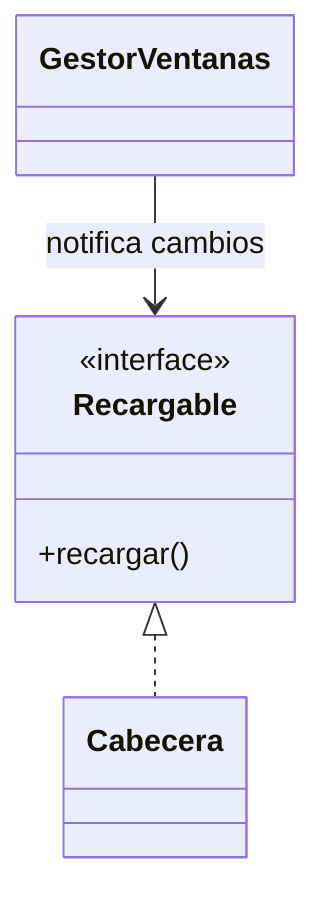

# Patrones de Software en Hispania360

Este documento describibimos brevemente los principales patrones de diseño utilizados en la aplicación.

---

## Referencia a Issues del Proyecto

Durante el desarrollo, muchas decisiones de diseño y cambios en la arquitectura han quedado documentadas en los issues del repositorio. Para facilitar el rastreo de decisiones y justificaciones, se referencian los issues relevantes en cada patrón.


---

## 1. Patrón Singleton

El patrón Singleton se implementa usando enums en Java para garantizar una única instancia global. Por ejemplo, la gestión de sesión y el controlador principal:

> **Referencias:**  
> - [Issue #27](https://github.com/rubmoyanop/pds2025-plataforma-aprendizaje/issues/27): Decisión de usar enums para los singleton por seguridad y simplicidad.  
> - [Issue #19](https://github.com/rubmoyanop/pds2025-plataforma-aprendizaje/issues/19): Justificación de la clase `Sesion` como singleton para la gestión de usuario actual.  
> - [Issue #13](https://github.com/rubmoyanop/pds2025-plataforma-aprendizaje/issues/13): Uso de singleton en `GestorVentanas`.

```java
// src/main/java/pds/hispania360/sesion/Sesion.java
public enum Sesion {
    INSTANCIA;
    private Usuario usuarioActual;
    private Curso cursoActual;
    ...
}
```
[Ver Sesion.java](../src/main/java/pds/hispania360/sesion/Sesion.java)

```java
// src/main/java/pds/hispania360/controlador/Controlador.java
public enum Controlador {
    INSTANCIA;
    ...
}
```
[Ver Controlador.java](../src/main/java/pds/hispania360/controlador/Controlador.java)

Esto permite acceder a la sesión o al controlador desde cualquier parte de la aplicación de forma segura y sin duplicados:
```java
Sesion.INSTANCIA.getUsuarioActual();
Controlador.INSTANCIA.actualizarExperiencia(100);
```

---

## 2. Patrón Modelo-Vista-Controlador (MVC)

La arquitectura separa claramente la lógica de negocio (modelo), la interfaz gráfica (vista) y el flujo de la aplicación (controlador):

> **Referencias:**  
> - [Issue #13](https://github.com/rubmoyanop/pds2025-plataforma-aprendizaje/issues/13): Decisión sobre la estructura de ventanas y la interfaz `Ventana`.  
> - [Issue #19](https://github.com/rubmoyanop/pds2025-plataforma-aprendizaje/issues/19): Separación de roles y lógica de sesión en la arquitectura.



- **Vista:** Clases como [`VentanaCursos`](../src/main/java/pds/hispania360/vista/pantallas/VentanaCursos.java), [`VentanaLogin`](../src/main/java/pds/hispania360/vista/pantallas/VentanaLogin.java), [`TarjetaCurso`](../src/main/java/pds/hispania360/vista/componentes/TarjetaCurso.java`).  
  Ejemplo:  
  ```java
  public class VentanaCursos implements Ventana, Recargable {
     // ...código...
  }
  ```
- **Controlador:** [`Controlador`](../src/main/java/pds/hispania360/controlador/Controlador.java), que orquesta la lógica de negocio y la comunicación entre modelo y vista.  
  Ejemplo:  
  ```java
  public enum Controlador {
      INSTANCIA;
      public List<Curso> obtenerCursosDelUsuarioActual() { 
        // ...código...
      }
  }
  ```
- **Modelo:** Clases como [`Curso`](../src/main/java/pds/hispania360/modelo/Curso.java), [`Usuario`](../src/main/java/pds/hispania360/modelo/Usuario.java), [`ProgresoCurso`](../src/main/java/pds/hispania360/modelo/ProgresoCurso.java), [`EstadisticasUsuario`](../src/main/java/pds/hispania360/modelo/EstadisticasUsuario.java`).  
  Ejemplo:  
  ```java
  @Entity
  public class Curso {
      @Id
      private Integer id;
      private String titulo;
      @ManyToOne
      private Usuario creador;
      // ...
  }
  ```

---

## 3. Patrón Factoría (Factory)

La creación de estrategias de aprendizaje y ejercicios se realiza mediante factorías:

> **Referencias:**  
> - [Issue #21](https://github.com/rubmoyanop/pds2025-plataforma-aprendizaje/issues/21): Uso de Factory Method para la creación de bloques y ejercicios.  
> - [Issue #23](https://github.com/rubmoyanop/pds2025-plataforma-aprendizaje/issues/23): Implementación de importación de cursos y uso de factoría para ejercicios.  
> - [Issue #51](https://github.com/rubmoyanop/pds2025-plataforma-aprendizaje/issues/51): Revisión de la implementación de estrategias y factorías.



**Estrategias de aprendizaje:**  
[`FactoriaEstrategia.java`](../src/main/java/pds/hispania360/factoria/FactoriaEstrategia.java)
```java
public enum FactoriaEstrategia {
    INSTANCIA;
    private static final Map<String, Supplier<EstrategiaAprendizaje>> estrategias = Map.of(
        "secuencial", EstrategiaSecuencial::new,
        "repeticion espaciada", EstrategiaRepeticionEspaciada::new,
        "random", EstrategiaRandom::new
    );
    public EstrategiaAprendizaje crearEstrategia(String tipo) {
        Supplier<EstrategiaAprendizaje> supplier = estrategias.get(tipo.toLowerCase());
        if (supplier != null) return supplier.get();
        throw new IllegalArgumentException("Estrategia desconocida: " + tipo);
    }
}
```
**Ejercicios:**  
[`FactoriaEjercicio.java`](../src/main/java/pds/hispania360/factoria/FactoriaEjercicio.java)
```java
public enum FactoriaEjercicio {
    INSTANCIA;
    public Ejercicio crearEjercicio(JsonNode ejercicioNode) {
        switch (tipo) {
            case "respuesta_multiple": return crearRespuestaMultiple(ejercicioNode);
            case "rellenar_hueco": return crearRellenarHueco(ejercicioNode);
            case "flashcard": return crearFlashcard(ejercicioNode);
            // ...
        }
    }
}
```
Esto permite desacoplar la creación de objetos complejos y facilita la extensión de nuevos tipos de ejercicios tal y como se pide en el enunciado de la práctica.

---

## 4. Patrón Repositorio y DAO

El acceso a la base de datos está encapsulado en repositorios persistentes, que implementan interfaces DAO.

> **Referencias:**  
> - [Issue #45](https://github.com/rubmoyanop/pds2025-plataforma-aprendizaje/issues/45): Decisiones sobre la persistencia, generación de IDs y configuración de relaciones en JPA.



Por ejemplo, para cursos:

[`RepositorioCursoPersistente.java`](../src/main/java/pds/hispania360/persistencia/RepositorioCursoPersistente.java)
```java
public enum RepositorioCursoPersistente implements RepositorioCurso {
    INSTANCIA;
    private EntityManagerFactory emf;
    // Métodos CRUD: agregarCurso, obtenerCurso, eliminarCurso, etc.
    public void crearCurso(String titulo, String descripcion, Usuario creador, ArrayList<Bloque> bloques, LocalDate fechaCreacion) {
        // Usamos JPA para persistir el curso
    }
    public List<Curso> obtenerCursosPorUsuario(int usuarioId) {
        // Consultas con JPQL
    }
}
```
Esto permite cambiar la implementación de persistencia sin afectar al resto de la aplicación.

---

## 5. Patrón Estrategia

Las estrategias de aprendizaje son intercambiables y se usan en el progreso de curso:

> **Referencias:**  
> - [Issue #20](https://github.com/rubmoyanop/pds2025-plataforma-aprendizaje/issues/20): Implementación de la elección de estrategia de aprendizaje.  
> - [Issue #51](https://github.com/rubmoyanop/pds2025-plataforma-aprendizaje/issues/51): Revisión de la implementación de estrategias.



[`EstrategiaAprendizaje.java`](../src/main/java/pds/hispania360/modelo/EstrategiaAprendizaje.java)
```java
public interface EstrategiaAprendizaje {
    Ejercicio siguienteEjercicio(List<Ejercicio> ejercicios, int progreso);
}
```
Implementaciones:  
[`EstrategiaSecuencial.java`](../src/main/java/pds/hispania360/modelo/EstrategiaSecuencial.java), [`EstrategiaRepeticionEspaciada.java`](../src/main/java/pds/hispania360/modelo/EstrategiaRepeticionEspaciada.java), [`EstrategiaRandom.java`](../src/main/java/pds/hispania360/modelo/EstrategiaRandom.java)

```java
public class EstrategiaSecuencial implements EstrategiaAprendizaje {
    public Ejercicio siguienteEjercicio(List<Ejercicio> ejercicios, int progreso) {
        if (progreso < ejercicios.size()) return ejercicios.get(progreso);
        return null;
    }
}
```
Y se seleccionan dinámicamente en el progreso del curso:  
[`ProgresoCurso.java`](../src/main/java/pds/hispania360/modelo/ProgresoCurso.java)
```java
public EstrategiaAprendizaje getEstrategia() {
    if (estrategia == null && estrategiaTipo != null) {
        estrategia = FactoriaEstrategia.INSTANCIA.crearEstrategiaPorNombre(estrategiaTipo);
    }
    return estrategia;
}
```
Esto permite adaptar el recorrido de ejercicios a cada estrategia fácilmente.

---

## 6. Observador (Observer)

> **Referencias:**  
> - [Issue #13](https://github.com/rubmoyanop/pds2025-plataforma-aprendizaje/issues/13): Justificación de la interfaz `Recargable` para recarga de vistas.



La interfaz [`Recargable`](../src/main/java/pds/hispania360/vista/core/Recargable.java) permite que las vistas se actualicen automáticamente cuando cambia el estado de la sesión o los datos:

```java
public interface Recargable {
    void recargar();
}
```
Ejemplo de uso en [`Cabecera.java`](../src/main/java/pds/hispania360/vista/componentes/Cabecera.java):
```java
public class Cabecera extends JPanel implements Recargable {
    @Override
    public void recargar() {
        removeAll();
        initialize();
        revalidate();
        repaint();
    }
}
```
El método `recargar()` es invocado por el gestor de ventanas cuando hay cambios relevantes, como el inicio/cierre de sesión, para que la interfaz muestre la información actualizada del usuario.

---

